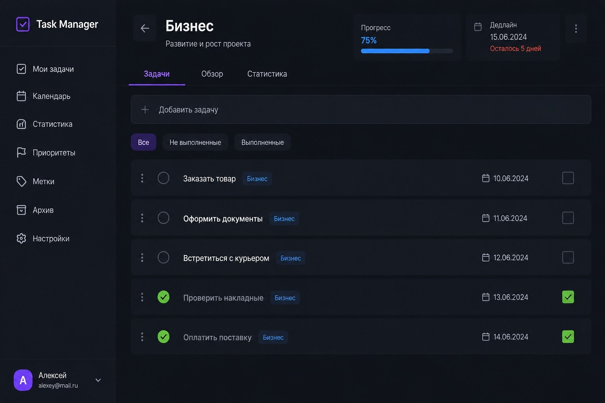
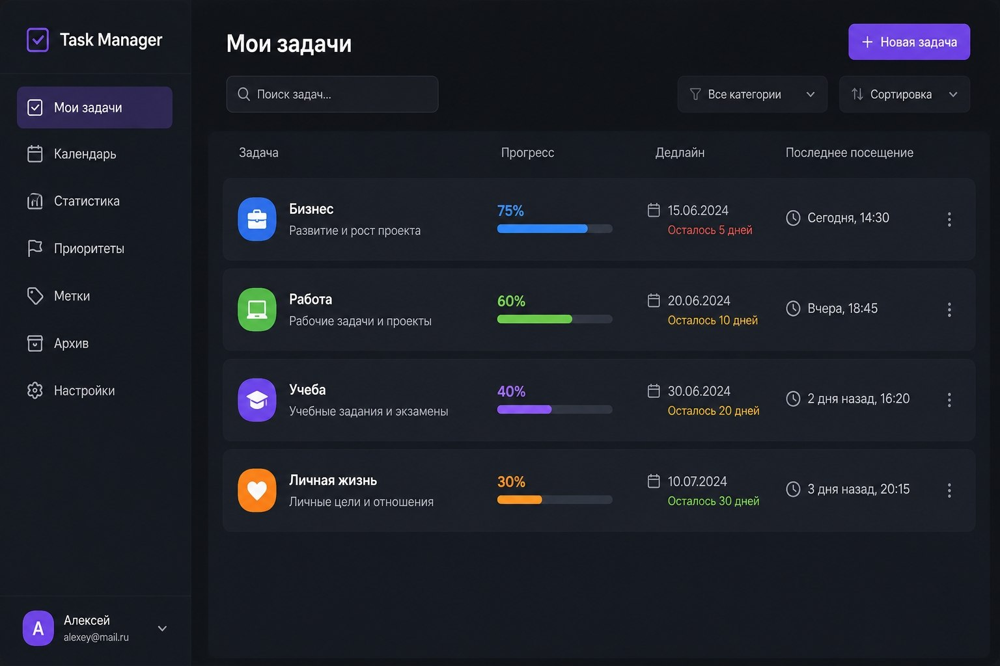

# Task Manager Master Plan

> Master document for the Task Manager project. Future subplans must reference this document by section IDs such as `MP-01`, `MP-02`, and `MP-08`.

**Project:** Team Task Manager  
**Document status:** Approved baseline for subplanning  
**Created:** 2026-06-07  
**Primary language:** Russian UI  
**Primary user flow:** sign in -> see project list with progress -> open Kanban project -> manage tasks -> inspect calendar/statistics

---

## MP-01. Product Vision

Build a polished Russian-language team task manager with a dark desktop-first interface close to the provided screenshots. The product combines a clean project overview with a Jira-like Kanban workflow, calendar deadlines, and simple progress analytics.

The first release is not a generic personal todo list. It is a small team workspace where users can organize projects, assign work, move tasks through a board, and understand whether work is on track.

### Success Definition

The MVP is successful when a user can:

1. Register or sign in.
2. Enter one team workspace.
3. See a project list with progress, deadlines, and last-visited metadata.
4. Create a project.
5. Add an existing registered user to the workspace.
6. Create tasks with title, description, status, priority, assignee, due date, and labels.
7. Move tasks through Kanban columns.
8. See project progress update from completed tasks.
9. See task deadlines in a monthly calendar.
10. See simple statistics that match the same underlying data.

---

## MP-02. Product Scope

### MVP In Scope

- Authentication with email/password through Supabase Auth.
- One workspace per user/team in the first release.
- Roles: `owner` and `member`.
- Project list as the first screen after login.
- Project detail page with Kanban board.
- Task creation, editing, assignment, priority, labels, due dates, and status movement.
- Monthly calendar with task deadlines.
- Statistics for project progress, task statuses, overdue tasks, and recent activity.
- Settings section for account/workspace basics and team membership.
- Supabase Edge Function for secure member addition by email.
- Activity-event table as foundation for future notifications and comments.

### MVP Out Of Scope

- Multi-workspace switching.
- Public marketing site.
- Production frontend hosting.
- Email invitations.
- Realtime collaborative board updates.
- Comments UI.
- Notifications UI.
- File attachments.
- Custom Kanban statuses.
- Scrum sprints, velocity, lead time, cycle time.
- Billing, subscriptions, or SaaS tenant management.
- Native mobile app.

### Future Expansion Areas

- Realtime updates with Supabase Realtime.
- Comments and mentions.
- Notification center and email notifications.
- Attachments through Supabase Storage.
- Multi-workspace switcher.
- Custom workflows and custom statuses.
- Sprint planning and reporting.
- Advanced team workload analytics.
- Production frontend deployment.

---

## MP-03. Users And Roles

### Roles

- `owner`: owns the workspace, can manage workspace settings and add members.
- `member`: can view workspace projects and work with tasks.

### MVP Permission Rules

- Workspace data is visible only to authenticated workspace members.
- Only `owner` can add members to the workspace.
- Members can create and edit tasks inside workspace projects.
- Members can move tasks through board columns.
- Project archiving and destructive project-level actions should be owner-only unless a later subplan intentionally broadens this.

### Key User Personas

- Team owner: creates the workspace, invites/adds members, tracks project progress.
- Team member: views assigned work, updates task status, follows deadlines.

---

## MP-04. Information Architecture

### Primary Navigation

- `Мои задачи` or `Проекты`: first screen after login; project list with progress.
- `Календарь`: monthly deadline calendar.
- `Статистика`: dashboard with progress and status analytics.
- `Настройки`: account, workspace, and team management.

The visual sidebar can still show future sections such as `Приоритеты`, `Метки`, and `Архив`, but MVP implementation should either hide them or present them as non-primary future navigation. Do not build full pages for these in MVP unless a later subplan expands scope.

### Routes

- `/login`: authentication screen.
- `/app/projects`: project list and first authenticated screen.
- `/app/projects/:projectId`: project workspace with tabs.
- `/app/calendar`: monthly calendar.
- `/app/stats`: statistics dashboard.
- `/app/settings`: account/workspace/team settings.

### Project Detail Tabs

- `Доска`: default tab; Jira-like Kanban board.
- `Обзор`: compact project summary, members, recent activity, upcoming deadlines.
- `Статистика`: project-specific progress and status counts.

---

## MP-05. UX And Visual Direction

### Design Reference Screenshots

The original screenshots from the planning conversation are the primary visual reference for MVP UI decisions. Store them in `docs/assets/reference-design/` with these exact filenames so future agents can inspect them alongside this plan:





Reference screenshot 01 defines the project detail direction: dark sidebar, back button, project header, progress/deadline cards, tabs, inline add-task control, task filters, task rows, completion controls, deadlines, and purple active tab styling.

Reference screenshot 02 defines the first authenticated screen direction: dark sidebar, active navigation state, search, category filter, sorting control, primary create button, project rows with icon, title, description, progress, deadline, last visit, and row action menu.

The UI should closely follow the screenshots:

- Dark app shell and dark content background.
- Left sidebar with logo, navigation, and user profile block.
- Purple accent for active navigation, selected tabs, and primary actions.
- Soft dark cards/panels with subtle borders and shadows.
- Compact operational layout rather than a marketing-style landing page.
- Colored project icons.
- Clear progress bars and deadline status text.
- Professional Russian copy.

### First Screen After Login

The user sees a project list similar to the second screenshot:

- Page title: `Мои задачи` or `Проекты`.
- Search input.
- Category/status filter.
- Sorting control.
- Primary create button.
- Rows/cards with:
  - project icon;
  - project name;
  - description;
  - progress percentage and bar;
  - deadline;
  - days left or overdue state;
  - last visit;
  - context menu.

### Project Detail Screen

The user sees:

- Back button.
- Project name and description.
- Progress card.
- Deadline card.
- More/actions menu.
- Tabs.
- Kanban board as default work area.

### Task Detail UX

- Clicking a Kanban card opens a right-side drawer.
- On mobile, the drawer becomes full-screen or bottom-sheet style.
- The board remains the main context while editing.
- Form fields should be compact and work-focused.

### Responsive Rules

- Desktop-first.
- Mobile usable, not full mobile-optimized workflow.
- Sidebar collapses on smaller screens.
- Kanban supports horizontal scroll.
- No text overlap, clipped controls, or unreadable buttons on mobile.

---

## MP-06. Technology Stack

### Frontend

- React.
- TypeScript.
- Vite.
- React Router.
- TanStack Query.
- MUI as the primary UI component library.
- Emotion/MUI theme customization for the dark visual system.
- MUI Icons for common interface icons.
- `@dnd-kit/core` and `@dnd-kit/sortable` for Kanban drag-and-drop.
- Zod for schema validation.

### Backend

- Supabase Auth.
- Supabase Postgres.
- Supabase Row Level Security.
- Supabase Edge Functions.
- Supabase generated TypeScript database types.

### Testing And QA

- Vitest for unit and integration-level logic.
- React Testing Library for component behavior where useful.
- Playwright for end-to-end flows.
- Supabase local development for schema and RLS testing when implementation begins.

### Deployment Assumption

MVP frontend runs locally. Supabase is the backend. Supabase Edge Functions are used for secure backend operations, not for primary React SPA hosting.

---

## MP-07. Architecture

### High-Level Architecture

React SPA talks to Supabase for authenticated data access. Most CRUD operations are performed directly from the client through `supabase-js`, protected by RLS. Supabase Edge Functions are used only where direct browser access is unsafe or would leak privileged lookup behavior.

### Frontend Module Boundaries

Recommended source structure for implementation:

- `src/app`: app providers, router, theme, query client.
- `src/features/auth`: login, signup, session handling.
- `src/features/shell`: sidebar, layout, protected app frame.
- `src/features/projects`: project list, project detail header, project CRUD.
- `src/features/board`: Kanban columns, drag-and-drop, board ordering.
- `src/features/tasks`: task drawer, task forms, task mutations.
- `src/features/team`: workspace members and member addition.
- `src/features/calendar`: monthly deadline calendar.
- `src/features/stats`: statistics dashboards and aggregations.
- `src/features/settings`: account/workspace settings.
- `src/shared`: reusable UI primitives, date helpers, formatting, constants.
- `src/lib/supabase`: Supabase client and typed query helpers.

### State Management

- Use TanStack Query for server state.
- Keep local UI state in React state.
- Avoid global client stores in MVP unless a later subplan proves they are needed.
- Use optimistic updates for Kanban drag-and-drop and small task edits.
- Roll back optimistic updates on Supabase mutation failure.

### Data Flow

1. User signs in with Supabase Auth.
2. App loads the user profile and workspace membership.
3. Project list query loads projects and computed progress.
4. Opening a project loads project metadata, members, labels, and tasks.
5. Kanban groups tasks by status.
6. Moving a task updates status and position.
7. Calendar and statistics read from the same task/project tables.

---

## MP-08. Data Model

### Core Tables

#### `profiles`

Stores public user profile data linked to Supabase Auth users.

Recommended fields:

- `id uuid primary key references auth.users(id)`
- `email text not null`
- `display_name text`
- `avatar_url text`
- `created_at timestamptz`
- `updated_at timestamptz`

#### `workspaces`

Stores the team workspace.

Recommended fields:

- `id uuid primary key`
- `name text not null`
- `created_by uuid references profiles(id)`
- `created_at timestamptz`
- `updated_at timestamptz`

#### `workspace_members`

Stores membership and role.

Recommended fields:

- `workspace_id uuid references workspaces(id)`
- `user_id uuid references profiles(id)`
- `role text check role in ('owner', 'member')`
- `created_at timestamptz`

Unique key: `(workspace_id, user_id)`.

#### `projects`

Stores project/task-space cards from the first screen.

Recommended fields:

- `id uuid primary key`
- `workspace_id uuid references workspaces(id)`
- `name text not null`
- `description text`
- `icon_name text`
- `color text`
- `deadline date`
- `archived_at timestamptz`
- `created_by uuid references profiles(id)`
- `created_at timestamptz`
- `updated_at timestamptz`

#### `tasks`

Stores Kanban tasks.

Recommended fields:

- `id uuid primary key`
- `workspace_id uuid references workspaces(id)`
- `project_id uuid references projects(id)`
- `title text not null`
- `description text`
- `status text check status in ('backlog', 'todo', 'in_progress', 'review', 'done')`
- `priority text check priority in ('low', 'medium', 'high', 'urgent')`
- `assignee_id uuid references profiles(id)`
- `due_date date`
- `position numeric not null`
- `created_by uuid references profiles(id)`
- `created_at timestamptz`
- `updated_at timestamptz`

#### `labels`

Stores workspace labels.

Recommended fields:

- `id uuid primary key`
- `workspace_id uuid references workspaces(id)`
- `name text not null`
- `color text`
- `created_at timestamptz`

#### `task_labels`

Joins tasks and labels.

Recommended fields:

- `task_id uuid references tasks(id)`
- `label_id uuid references labels(id)`

Unique key: `(task_id, label_id)`.

#### `project_visits`

Stores last project visit per user.

Recommended fields:

- `project_id uuid references projects(id)`
- `user_id uuid references profiles(id)`
- `visited_at timestamptz`

Unique key: `(project_id, user_id)`.

#### `activity_events`

Append-only foundation for future notifications and comments.

Recommended fields:

- `id uuid primary key`
- `workspace_id uuid references workspaces(id)`
- `project_id uuid references projects(id)`
- `task_id uuid references tasks(id)`
- `actor_id uuid references profiles(id)`
- `event_type text not null`
- `payload jsonb not null default '{}'::jsonb`
- `created_at timestamptz`

### Progress Formula

Project progress is not stored as source-of-truth. It is computed as:

```text
done task count / active task count
```

If a project has zero active tasks, progress should render as `0%`.

---

## MP-09. Security And RLS

### RLS Principles

- Enable RLS on all browser-accessible tables.
- Every workspace-scoped record must be readable only by workspace members.
- Owner-only actions must check membership role.
- Browser code must never use Supabase service role keys.
- Edge Functions may use service role only server-side and only after validating the caller.

### Required Policy Categories

- Profiles:
  - authenticated user can read profiles that belong to the same workspace;
  - authenticated user can update their own profile.
- Workspaces:
  - members can read their workspace;
  - owner can update workspace basics.
- Workspace members:
  - members can read workspace membership list;
  - only owner can insert or remove members.
- Projects:
  - members can read projects in their workspace;
  - members can create projects;
  - owner can archive/delete projects.
- Tasks:
  - members can read tasks in their workspace;
  - members can create and update tasks in their workspace.
- Labels/task labels:
  - members can read and use labels in their workspace.
- Activity events:
  - members can read workspace events;
  - inserts should happen through controlled app mutations or Edge Functions.

---

## MP-10. Edge Functions

### `add-workspace-member`

Purpose: owner adds an existing registered user to the workspace by email.

Input:

```json
{
  "workspaceId": "uuid",
  "email": "member@example.com",
  "role": "member"
}
```

Behavior:

1. Validate caller is authenticated.
2. Validate caller is `owner` of the workspace.
3. Normalize and validate email.
4. Find existing profile by email.
5. Reject if profile does not exist.
6. Reject if user is already a member.
7. Insert `workspace_members` row.
8. Insert `activity_events` row.
9. Return the added member profile and role.

Error codes:

- `unauthenticated`
- `not_owner`
- `invalid_email`
- `invalid_role`
- `user_not_found`
- `already_member`
- `internal_error`

### Future Edge Functions

- `create-notification`
- `send-email-invite`
- `process-attachment`
- `generate-report`

These are not MVP deliverables unless a later subplan explicitly adds them.

---

## MP-11. Feature Requirements

### Authentication

- Email/password sign in and sign up.
- Protected app routes.
- Session persistence.
- Logout from sidebar profile area.

### Project List

- Search projects by name/description.
- Filter by active/archived status if archive is implemented in schema.
- Sort by deadline, progress, last visit, and creation date.
- Show progress and deadline status.
- Update `project_visits` when a project opens.

### Kanban Board

- Columns:
  - `Backlog`
  - `To Do`
  - `In Progress`
  - `Review`
  - `Done`
- Drag task between columns.
- Reorder task inside a column.
- Persist `status` and `position`.
- Empty columns remain visible.
- Failed move rolls back UI and shows error.

### Task Drawer

- Create task.
- Edit title and description.
- Change status.
- Change assignee.
- Change priority.
- Set or clear due date.
- Add or remove labels.
- Show created and updated timestamps.

### Calendar

- Month grid.
- Show task deadlines on their dates.
- Highlight overdue tasks.
- Provide project color/icon context.
- Clicking a task opens the task drawer or navigates to the project and opens the task.

### Statistics

- Overall completion by project.
- Tasks by status.
- Overdue tasks.
- Upcoming deadlines.
- Recent activity list from `activity_events`.

### Settings

- Current user profile basics.
- Workspace name.
- Workspace member list.
- Owner-only add existing member by email.

---

## MP-12. Testing Strategy

### Unit Tests

- Progress calculation.
- Deadline status formatting.
- Task grouping by Kanban status.
- Position calculation for drag-and-drop.
- Zod validation schemas.

### Integration Tests

- Auth-protected route behavior.
- Project list data mapping.
- Task drawer form submit behavior.
- Query invalidation after mutations.

### Supabase/RLS Tests

- User cannot read another workspace.
- Member cannot add another member.
- Owner can add an existing registered user.
- Duplicate member insert is rejected.
- Task operations require workspace membership.

### E2E Tests

- Sign in.
- Create project.
- Open project.
- Create task.
- Move task to `Done`.
- Confirm progress updates.
- Confirm task appears in calendar.
- Confirm statistics reflect the change.

### Visual QA

- Desktop project list resembles screenshot direction.
- Project detail/Kanban keeps dark style and compact spacing.
- Mobile does not overlap text or controls.
- Drawer remains usable on desktop and mobile.

---

## MP-13. Subplan System

Future implementation should be split into subplans. Each subplan must:

- Reference this master plan by MP section IDs.
- Define exact scope and non-scope.
- Define deliverables.
- Define files or folders to create/modify.
- Define data/API contracts touched by the subplan.
- Define tests and acceptance criteria.
- Avoid changing unrelated project areas.

Recommended subplans:

- `SP-01 Foundation`: Vite, React, TypeScript, MUI, routing, app shell.
- `SP-02 Supabase Schema`: migrations, RLS, generated types, seed data.
- `SP-03 Auth And Workspace`: auth screens, protected routes, profile, one-workspace bootstrap.
- `SP-04 Project List`: first screen, project CRUD, search/filter/sort, progress, visits.
- `SP-05 Kanban And Tasks`: board, drag/drop, task drawer, task CRUD.
- `SP-06 Team And Edge Functions`: member addition by email, activity events.
- `SP-07 Calendar And Statistics`: deadline calendar and dashboard analytics.
- `SP-08 QA And Polish`: responsive, accessibility, empty/error/loading states, E2E.
- `SP-09 Future Collaboration`: comments, notifications, realtime, attachments.

---

## MP-14. Implementation Order

1. Foundation and design system.
2. Supabase schema and local backend setup.
3. Auth and protected app shell.
4. Project list first screen.
5. Project detail and Kanban board.
6. Task drawer and task mutations.
7. Team member management through Edge Function.
8. Calendar and statistics.
9. QA, responsive polish, and E2E coverage.

This order keeps every phase independently testable and avoids building analytics before the underlying task workflow exists.

---

## MP-15. Risks And Decisions

### Key Decisions

- Use MUI because documentation, ecosystem size, and complex component coverage are more important than maximum visual ownership for this project.
- Use Supabase RLS as the primary security boundary.
- Use Edge Functions only for operations that need server-side privilege or controlled lookup.
- Keep one workspace in MVP to reduce product and security complexity.
- Do not include realtime in MVP, but avoid architecture that blocks it later.

### Main Risks

- RLS mistakes can leak workspace data. Mitigation: write dedicated RLS tests early.
- Kanban ordering can become fragile. Mitigation: isolate position calculation and test it.
- MUI default visuals can look too generic. Mitigation: define custom theme tokens before building feature screens.
- Supabase-only deployment expectation can be misunderstood. Mitigation: document that Supabase backs data/functions, while frontend hosting is separate or local in MVP.

---

## MP-16. Reference Documentation

- React: https://react.dev/
- Vite: https://vite.dev/guide/
- MUI: https://mui.com/
- Supabase Auth React quickstart: https://supabase.com/docs/guides/auth/quickstarts/react
- Supabase Row Level Security: https://supabase.com/docs/guides/database/postgres/row-level-security
- Supabase Edge Functions: https://supabase.com/docs/guides/functions
- TanStack Query: https://tanstack.com/query/docs
- dnd-kit sortable: https://docs.dndkit.com/presets/sortable
- React Router: https://reactrouter.com/
- Vitest: https://vitest.dev/
- Playwright: https://playwright.dev/
